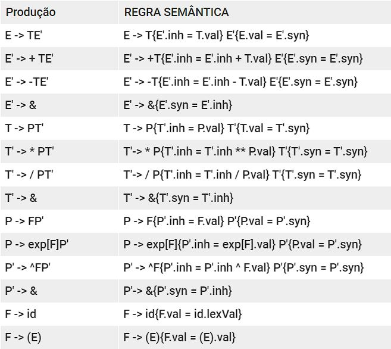

# Compilador

# Gramática 
* E -> E+T | E-T | T

* T -> T*P | T/P | P

* P -> P^F | exp[F] | F

* F -> (E) | id

# Tipo Preditivo não recursivo
* E  -> TE'
* E' -> +TE' | -TE' | e
* T  -> PT'
* T' -> *PT' | /PT' | e
* P  -> EXP[F]P' | FP'
* P' -> ^FP' | e
* F  -> (E) | id

# Realiza operações do tipo

* 1+2*3^4  			 = 163
* 
* (1+2)*3^4 			= 243
* 
* 1+(2*3)^4 			= 1297
* 
* 1+(2*3)+exp[4]  = 61,598150033

# Léxico

# Sintático

### First 

* FIRST E -> {exp, (, id}
* FIRST E' -> {+ , - , e}
* FIRST T -> {exp, ( , id}
* FIRST T' -> {*, / , e} 
* FIRST P -> {exp , ( , id}
* FIRST P' -> {^ , e}
* FIRST F -> { ( , id}

### Follow 

* FOLLOW E -> { ) , $}
* FOLLOW E' ->  { ) , $}
* FOLLOW T -> { + , - , ) , $}
* FOLLOW T' -> { + , - , ) , $}
* FOLLOW P -> { *, / , + , - , ) , $}
* FOLLOW P' -> {* , / , + , - , ) , $}
* FOLLOW F -> { ] , ^ , * , / , + , - , ) , $}

# Semântica

####Definição dirigida pela sintaxe
 descendente L-atribuido

